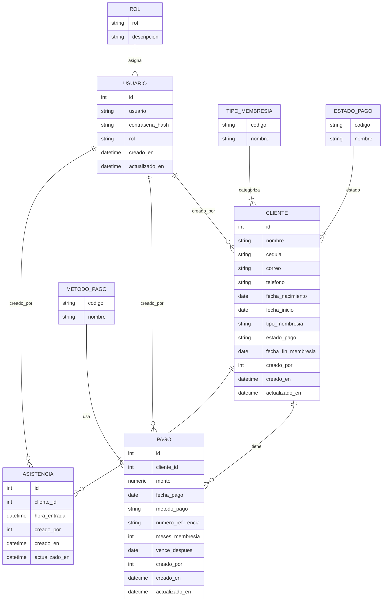

# AGENTS — JEY POWER GYM F.P.

Documento vivo para mantener el contexto funcional y técnico del proyecto.

## Visión
“Sistema Digital de Entradas y Seguimiento de Clientes” para el gimnasio JEY POWER GYM F.P. El sistema gestiona clientes, pagos, membresías y control de asistencia, con métricas operativas en un dashboard.

## Roles
- admin: control total (usuarios, configuración, todo el CRUD)
- editor: operación diaria (clientes, pagos, asistencias) — sin gestión de usuarios

## Modelos (Mongoose)
- Customer
  - name (String, req)
  - cedula (String, req, unique)
  - email (String, opt)
  - phone (String, opt)
  - dateOfBirth (Date)
  - startDate (Date, default now)
  - membershipType (enum: 'Gym' | 'Xtrembike' | 'Diario' | 'Mensual' | 'Otro')
  - paymentStatus (enum: 'Activo' | 'Inactivo', default 'Inactivo')
  - membershipEndDate (Date)
  - createdBy (ObjectId → User, opt)
- User
  - username (String, req, unique)
  - password (String, req) — almacenar como hash (bcrypt/bcryptjs)
  - role (enum: 'admin' | 'editor', default 'editor')
- Payment
  - customer (ObjectId → Customer, req)
  - amount (Number, req)
  - paymentDate (Date, default now)
  - paymentMethod (enum: 'Efectivo' | 'Pago Movil' | 'Otro')
  - referenceNumber (String, opt)
  - membershipMonths (Number, default 1)
  - membershipEndAfter (Date) — nuevo vencimiento tras aplicar el pago
  - createdBy (ObjectId → User, opt)
- Attendance
  - customer (ObjectId → Customer, req)
  - checkInTime (Date, default now)
  - createdBy (ObjectId → User, opt)

## Reglas y Flujos clave
- Pago actualiza automáticamente el Customer:
  - membershipEndDate += membershipMonths (meses) desde la fecha vigente (si ya vencida, desde hoy)
  - paymentStatus = 'Activo' cuando la membresía está vigente; 'Inactivo' al vencer
- Asistencia (check-in) válida solo si paymentStatus === 'Activo' y hoy <= membershipEndDate
- Tipos de membresía según mapa mental: 'Gym', 'Xtrembike', 'Diario', 'Mensual', 'Otro'
- Métodos de pago: 'Efectivo', 'Pago Movil', 'Otro' (usar referenceNumber en Pago Movil)
- Usuarios del sistema: admin/editor; credenciales seguras (hash bcrypt) y mínimo 8 caracteres
 - Cronología de membresía: tras crear/editar/eliminar pagos se recalcula toda la cadena (orden por fecha) para actualizar `membershipEndAfter` y `membershipEndDate/paymentStatus` de forma consistente (maneja pagos con fecha pasada/futura).
 - Pago Móvil: `referenceNumber` es requerido cuando `paymentMethod = 'Pago Movil'` (validado en API y UI).

## Rutas API (plan)
- Auth
  - POST /api/auth/register — admin crea usuarios del sistema (hash usando bcryptjs)
  - POST /api/auth/login — devuelve sesión/JWT; luego migraremos a next-auth
  - POST /api/auth/change-password — usuario autenticado actualiza su contraseña
- Customers
  - GET /api/customers — lista + búsqueda por nombre/cedula
  - POST /api/customers — crea
  - GET /api/customers/:id — detalle
  - PUT /api/customers/:id — actualiza
  - DELETE /api/customers/:id — elimina (blando opcional)
- Payments
  - POST /api/payments — crea y aplica efectos colaterales en Customer
  - GET /api/payments?q=&customer=ID&from=YYYY-MM-DD&to=YYYY-MM-DD&page=1&limit=50&populate=1 — lista pagos con filtros (opcional populate de cliente). Respuesta: { success, data, page, total, hasMore }
  - GET /api/payments/export?format=csv&from=YYYY-MM-DD&to=YYYY-MM-DD — exporta CSV (opcional filtro por fechas y cliente)
- Attendance
  - POST /api/attendance — registra check-in validando vigencia (acepta { customer } o { cedula })
  - GET /api/attendance?q=&from=YYYY-MM-DD&to=YYYY-MM-DD&page=1&limit=20 — últimas asistencias con filtros (poblado de cliente). Respuesta: { success, data, page, total, hasMore }
 - Attendance Export
  - GET /api/attendance/export?format=csv&from=YYYY-MM-DD&to=YYYY-MM-DD&q= — exporta CSV de asistencias con filtros
 - Dashboard
  - GET /api/dashboard/metrics — métricas (total pagos, inscritos del mes, total clientes, clientes activos, asistencias de hoy)
   - Users (admin)
    - GET /api/users — listado de usuarios (admin-only)
    - PATCH /api/users/:id — actualizar rol (admin/editor), impide dejar el sistema sin admin
    - DELETE /api/users/:id — eliminar usuario (no permite eliminarse a sí mismo ni dejar sin admin)
 - Customers
  - GET /api/customers/export?format=csv&q= — exporta CSV de clientes con filtro por nombre/cédula
 - Payments (CRUD)
  - GET /api/payments/:id — detalle de un pago
  - PATCH /api/payments/:id — editar pago (valida monto > 0, meses >= 1; si metodo_pago = 'Pago Movil' requiere numero_referencia). Recalcula cronología de membresía del cliente.
  - DELETE /api/payments/:id — eliminar pago. Recalcula cronología de membresía del cliente.
 - Attendance (CRUD)
  - GET /api/attendance/:id — detalle de asistencia
  - PATCH /api/attendance/:id — editar asistencia (permitido cambiar cliente y/u hora_entrada; valida que el cliente esté activo en la fecha/hora indicada)
  - DELETE /api/attendance/:id — eliminar asistencia (corrección por registro erróneo)
 - Plans (Dynamic Pricing)
  - GET /api/plans — lista planes activos (public)
  - POST /api/plans — crear plan (admin)
  - PUT /api/plans/:id — editar plan (admin)
  - DELETE /api/plans/:id — eliminar/desactivar plan (admin)
 - Reports
  - GET /api/reports/daily?date=YYYY-MM-DD — reporte de cierre de caja diario

## UI (plan)
- /login — formulario de acceso
- /dashboard — métricas:
  - Total $ recibido (suma de Payments)
  - Inscritos del mes (Customers creados este mes)
  - Total de clientes (conteo global)
  - Clientes activos y asistencias de hoy
- /dashboard/clientes — tabla, buscador, modal de alta, CRUD
- Detalle de cliente — historial de pagos, formulario para nuevo pago
- /dashboard/pagos — listado de pagos con buscador (nombre/cédula)
- /dashboard/asistencias — check-in por cédula y últimas asistencias
  - Acciones en pagos: editar/eliminar con recálculo de vencimiento
  - Acciones en asistencias: editar/eliminar (corrección de registros)
 - /dashboard/perfil — cambio de contraseña del usuario
  - /dashboard/usuarios — (admin) listado, alta, cambio de rol y eliminación de usuarios

## Decisiones técnicas
- Next.js 14 (App Router). Directorio `app/`.
- Mongoose con helper `lib/dbConnect.js` usando caché global para dev/serverless.
- Tailwind para estilado rápido. `styles/globals.css` incluido en `app/layout.js`.
- Import ESM; `package.json` con `"type": "module"`.
- bcryptjs en lugar de bcrypt por compatibilidad de despliegue en serverless; API permanecerá igual (`compare`, `hash`).
- Validación con Zod en endpoints críticos: login, customers (POST/PUT), payments (POST), attendance (POST). Helpers en `lib/validation.js` con `parseSafe`.
 - Añadido ChangePasswordSchema para cambio de contraseña.
 - Recomputación centralizada de membresía: helper `lib/recomputeMembership.js` recalcula snapshots `membershipEndAfter` y estado del cliente.
 - Rate limiting básico por IP para auth: login (5/min), register (10/h), change-password (5/min) — `lib/rateLimit.js`.

## Variables de entorno
- MONGODB_URI — cadena MongoDB Atlas
 - JWT_SECRET — secreto para firmar/verificar JWT (cookies de sesión)

## Visión Estratégica (CEO & Product Owner)
Para convertir este MVP en la herramienta líder de gestión para gimnasios, debemos evolucionar de un "registro de datos" a un "sistema operativo de negocio".
1. **Fricción Cero en el Acceso:** El ingreso manual por cédula es lento. La meta es **Acceso QR** (rápido, moderno y sin contacto).
2. **Rigor Financiero:** No basta con registrar pagos. El dueño necesita un **Cierre de Caja** diario para conciliar efectivo vs. digital y evitar fugas de dinero.
3. **Flexibilidad Comercial:** Los precios cambian. Necesitamos un **Catálogo de Planes** dinámico (base de datos) en lugar de opciones fijas en código, permitiendo promociones ágiles.
4. **Retención Activa:** El sistema debe avisar no solo cuando alguien paga, sino cuando **deja de venir**. Reportes de "Riesgo de Abandono" y alertas de vencimiento.

## Roadmap Evolutivo

### Fase 1: Robustez Operativa y Financiera (Ready to Deploy)
- [x] **Catálogo de Planes (Dynamic Pricing):** Crear modelo `MembershipPlan` (nombre, precio, duración en días/meses). Eliminar hardcodeo de tipos de membresía.
- [x] **Cierre de Caja (Cash Reconciliation):** Reporte diario que agrupe pagos por método (Efectivo vs Digital) y usuario que cobró.
- [x] **Manejo de Errores Global:** Implementar `error.js` y `not-found.js` para fallos elegantes.
- [ ] **Despliegue:** Configuración para Vercel/Railway + MongoDB Atlas.

### Fase 2: Experiencia de Acceso (The "Wow" Factor)
- [ ] **Carnet Digital QR:** Generar un código QR único por cliente visible en su perfil o enviado por correo.
- [ ] **Modo Escáner:** Vista especial para el recepcionista que usa la cámara del dispositivo para leer QRs y registrar asistencia instantánea.
- [ ] **Fotos de Perfil:** Subida de imágenes (Cloudinary/S3) para verificación visual al ingreso.

### Fase 3: Inteligencia y Retención
- [ ] **Alertas de Vencimiento:** Emails automáticos (Resend/SendGrid) 3 días antes del vencimiento.
- [ ] **Reporte de Ausencia:** Listado de clientes activos que no han asistido en >7 días.
- [ ] **Dashboard Financiero Avanzado:** Gráficos de tendencia de ingresos (MRR) y retención mensual.

## Roadmap (Legacy/Completado)
1) Auth: /api/auth/register y /api/auth/login (bcryptjs) y preparar next-auth (Completado)
2) CRUD Customers: API + UI (/dashboard/clientes) (Completado)
3) Payments: endpoint que actualiza `membershipEndDate` y `paymentStatus` (Completado)
4) Dashboard KPIs: total pagos, inscritos del mes, total clientes (Completado)
5) Guardas de ruta en `middleware` (rol-based) incluyendo rutas API críticas (Completado)
6) Mejoras UX: paginación y filtros server-side en pagos (UI adaptada), toasts de éxito/error (Completado)
7) Export de asistencias a CSV en UI y API (Completado)

## Convenciones
- Validar entradas en API (Zod/Yup opcional)
- Respuestas JSON { success, data?, error? }
- Manejo de fechas en UTC y mostrar en tz local del cliente
- Índices: `cedula` unique en Customer; índices por `customer` en Payment/Attendance
  - Extras: Customer índice compuesto (`paymentStatus`, `membershipEndDate`); Payment índices por `paymentDate` y compuesto (`customer`,`paymentDate`); Attendance índices por `checkInTime` y compuesto (`customer`,`checkInTime`).
  - Pago Movil: índice único parcial en Payment.referenceNumber cuando `paymentMethod = 'Pago Movil'` para evitar referencias duplicadas.
 - GET paginado devuelve { data, page, total, hasMore } con `limit` y `page` en query.
   - Exportaciones CSV (clientes/pagos/asistencias) requieren autenticación.

## Enlaces rápidos
- Modelos: `models/*`
- Conexión: `lib/dbConnect.js`
- Rutas API: `app/api/*`
- Estilos: `styles/globals.css`

## Diagrama ER (Relacional simulado)
Este diagrama representa los modelos actuales como si fueran tablas relacionales con claves primarias/foráneas y catálogos para enums.

### Claves y restricciones (relacional)
- PK: `USUARIO(id)`, `CLIENTE(id)`, `PAGO(id)`, `ASISTENCIA(id)`; catálogos con PK natural: `ROL(rol)`, `TIPO_MEMBRESIA(codigo)`, `METODO_PAGO(codigo)`, `ESTADO_PAGO(codigo)`.
- FK: `CLIENTE(creado_por) → USUARIO(id)`; `PAGO(cliente_id) → CLIENTE(id)`; `PAGO(creado_por) → USUARIO(id)`; `ASISTENCIA(cliente_id) → CLIENTE(id)`; `ASISTENCIA(creado_por) → USUARIO(id)`; `CLIENTE(tipo_membresia) → TIPO_MEMBRESIA(codigo)`; `CLIENTE(estado_pago) → ESTADO_PAGO(codigo)`; `PAGO(metodo_pago) → METODO_PAGO(codigo)`.
- Únicos: `USUARIO(usuario)`; `CLIENTE(cedula)`; `PAGO(numero_referencia)` filtrado/partial cuando `metodo_pago = 'Pago Movil'`.
- Checks: `PAGO.monto > 0`; `PAGO.meses_membresia >= 1`; `numero_referencia IS NOT NULL` cuando `metodo_pago = 'Pago Movil'`.
- Índices sugeridos: `PAGO(cliente_id, fecha_pago)`; `ASISTENCIA(cliente_id, hora_entrada)`; `CLIENTE(estado_pago, fecha_fin_membresia)`; `PAGO(fecha_pago)`; `ASISTENCIA(hora_entrada)`.

Notas: `CUSTOMER.membership_end_date` y `CUSTOMER.payment_status` pueden mantenerse como columnas derivadas y recalculadas tras crear/editar/eliminar pagos (equivalente a nuestra recomputación), o derivarse vía vista/materialized view según motor.
